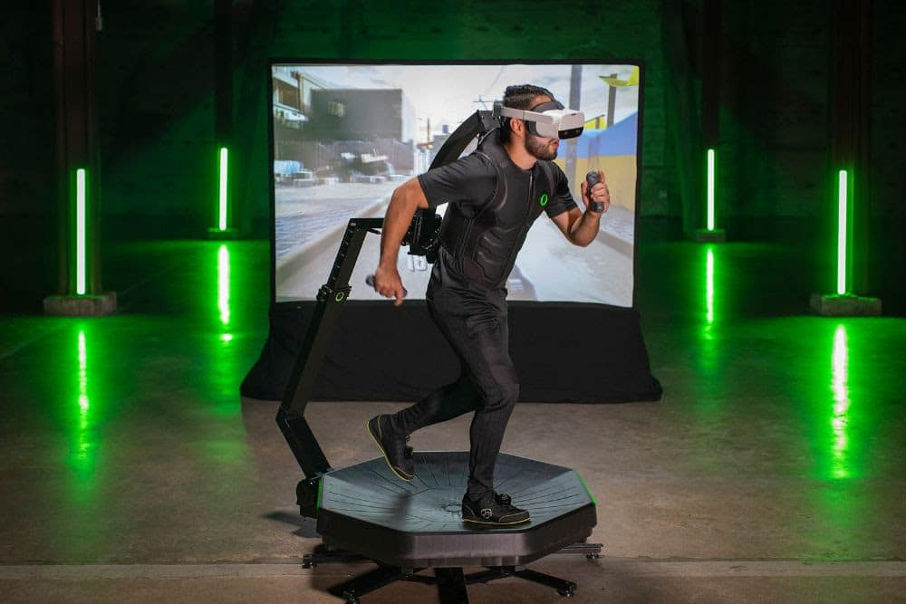
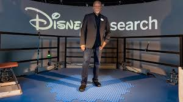

# 2.4 Avantages, défis sensoriels et potentiels

en cours de dev

<!--
Le toucher, la proprioception et la kinesthésie sont essentiels à notre interaction intuitive avec le monde, car ils nous informent sur la texture, la position et le mouvement, permettant une manipulation précise et adaptée des objets. En réalité virtuelle, malgré des progrès en retour haptique, cette richesse sensorielle reste difficile à reproduire, ce qui peut réduire le réalisme et l’intuitivité des interactions. En effet, selon Lécuyer (2009), « malgré les avancées, la simulation du toucher fin reste un défi majeur en VR, limitant la capacité à reproduire les sensations tactiles complexes nécessaires à des interactions naturelles.»(1)

Le monde réel impose des contraintes comme le besoin d’espaces spécifiques, le coût et la maintenance d’équipements lourds, ainsi que des limites de sécurité et de reproductibilité. En comparaison, la réalité virtuelle supprime beaucoup de ces obstacles : les environnements sont flexibles, moins coûteux à maintenir, sans risques physiques, et permettent des répétitions fidèles des expériences. Slater et Sanchez-Vives (2016) soulignent que « la VR offre la possibilité de créer des environnements contrôlés, sécurisés et facilement modifiables, éliminant ainsi les contraintes logistiques typiques du monde réel.» (2)

La VR offre aujourd’hui une immersion visuelle et auditive avancée grâce à des casques haute résolution, un large champ de vision et un son spatial précis. Le retour haptique indirect (vibrations, vestes haptiques) est en progrès, mais la simulation fine du toucher direct, avec toutes ses subtilités, reste limitée. Cummings et Bailenson (2016) expliquent que « les dispositifs actuels améliorent le ressenti par le biais du son et de la vision, mais le retour haptique reste encore peu développé et trop approximatif pour reproduire les sensations tactiles fines.»(3)

Reproduire la finesse du toucher: textures, pressions localisées, résistance, demeure un défi majeur pour la VR. Les dispositifs haptiques actuels comme les gants ou exosquelettes, bien que prometteurs, sont encore limités par leur précision, leur encombrement, leur coût et leur intégration technique. Lécuyer (2009) ajoute que « les contraintes matérielles et techniques freinent encore l’intégration fluide et réaliste d’un toucher direct dans les environnements virtuels.»(1)

La VR excelle par sa capacité à créer, modifier et reproduire facilement des environnements variés à faible coût. Elle permet de simuler des scénarios complexes et contrôlés, sans contraintes d’espace, de sécurité ou de logistique, facilitant la formation, la recherche et la collaboration à distance. Riva et Mantovani (2014) précisent que « la flexibilité offerte par la VR est un avantage décisif, permettant d’adapter et de répéter des expériences à volonté, ce qui est difficile à réaliser dans le monde réel.»(4)

Pour pallier certaines limites de l’interaction physique en VR, des dispositifs externes comme les tapis roulants omnidirectionnels ont été développés. Ces plateformes permettent à l’utilisateur de marcher naturellement dans n’importe quelle direction tout en restant physiquement immobile dans l’espace réel. Cela améliore la sensation de déplacement libre et augmente l’immersion sans nécessiter de grandes surfaces. Cependant, ces équipements présentent encore des inconvénients : ils sont coûteux, encombrants et nécessitent souvent un calibrage précis. Malgré cela, ils ouvrent la voie à une interaction corporelle plus réaliste, rapprochant l’expérience virtuelle de celle du monde réel.

 

[Tapis omnidirectionelle](https://www.realite-virtuelle.com/omni-one-tapis-vr-virtuix/) et [Tapis Disney](https://www.rtbf.be/article/disney-devoile-le-holotile-un-tapis-immersif-pour-la-realite-virtuelle-11318094)

-------------------------------------------------------------------------------------------------------------------------------

1. Lécuyer, A. (2009). Simulateur haptique et réalités virtuelles. IEEE Xplore.
https://ieeexplore.ieee.org/document/5235710
2. Slater, M., & Sanchez-Vives, M. V. (2016). Enhancing Our Lives with Immersive Virtual Reality. Frontiers in Robotics and AI, 3, 74.
https://www.ncbi.nlm.nih.gov/pmc/articles/PMC4923667/
3. Cummings, J. J., & Bailenson, J. N. (2016). How Immersive Is Enough? A Meta-Analysis of the Effect of Immersive Technology on User Presence. Cyberpsychology, Behavior, and Social Networking, 19(2), 87–91.
https://doi.org/10.1089/cyber.2015.0370
4. Riva, G., & Mantovani, F. (2014). Extending the self through the tools and the others: a general framework for presence and social presence in mediated interactions. Cognitive Processing, 15(4), 499–506.
https://journals.sagepub.com/doi/10.1177/1046878114534387
 -->