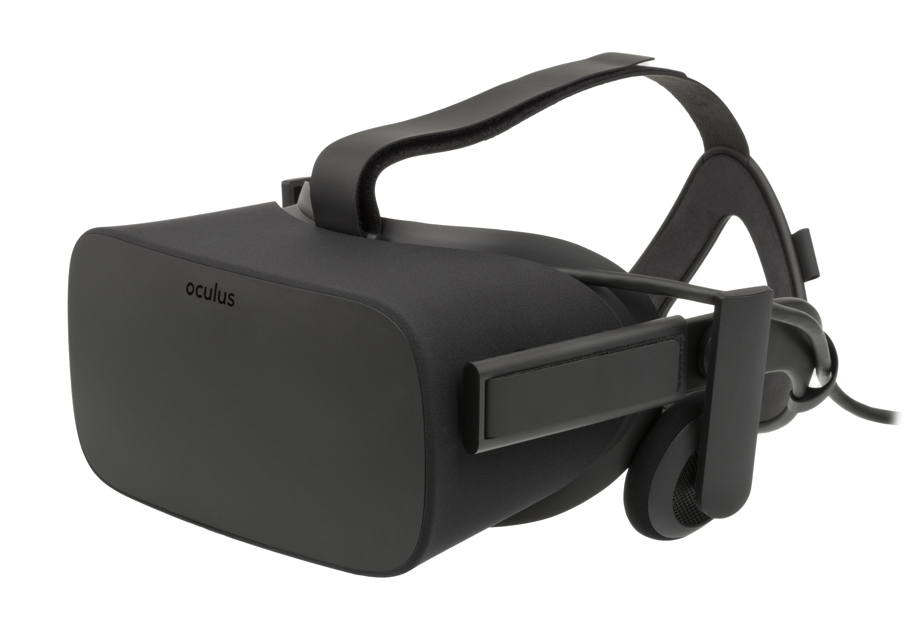
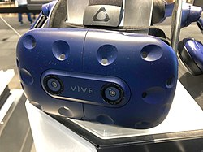
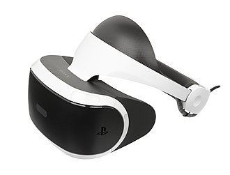

# 2.2 Évolution de la VR

## La Renaissance de la VR (Années 2000 à aujourd'hui)

Face à ces défis et aux déceptions commerciales, l'intérêt et les investissements dans la VR grand public ont considérablement diminué au début des années 2000, "En conséquence, après un pic d'intérêt et d'importants investissements, l'industrie ainsi que l'opinion publique ont commencé à se désintéresser de la réalité virtuelle et certaines entreprises ont fait faillite."(2) Cependant, la recherche et le développement n'ont pas cessé pour autant. On a assisté à un passage progressif vers des applications plus spécifiques et professionnelles, où les avantages de la VR pouvaient justifier les coûts et les limitations technologiques de l'époque. 

Après une période relative de stagnation dans le marché grand public, la réalité virtuelle a connu une renaissance spectaculaire à partir des années 2010, propulsée par un ensemble d'avancées technologiques clés qui ont permis de surmonter bon nombre des limitations des générations précédentes: 

- Écrans haute résolution et à faible latence: Le développement d'écrans OLED et LCD avec des résolutions beaucoup plus élevées: "Les avancées récentes dans la technologie d'affichage se sont concentrées sur l'augmentation de la résolution et du champ de vision, tout en réduisant l'effet de grille (lignes visibles entre les pixels qui nuisent à la qualité de l’image)."(4) et des taux de rafraîchissement plus rapides (diminuant la latence et le motion sickness): « Les écrans OLED offrent des rapports de contraste plus élevés et des taux de rafraîchissement plus rapides que leurs homologues LCD. Cette amélioration est essentielle pour réduire le flou de mouvement et la latence… »(4), ont considérablement amélioré la fidélité visuelle et le confort de l'expérience. L'intégration d'écrans à double résolution (un pour chaque œil) a permis une véritable perception stéréoscopique en 3D.

- Suivi précis et fiable (oculaire et spatial): Des systèmes de suivi sophistiqués, utilisant une combinaison de capteurs inertiels (IMU), de caméras externes (pour le suivi spatial des casques et des contrôleurs) et même de capteurs infrarouges, ont permis un suivi des mouvements de la tête et des mains beaucoup plus précis et avec une faible latence. L'introduction du suivi oculaire (eye-tracking) dans certains casques a ouvert de nouvelles possibilités pour l'interaction et le rendu fovéal: "La technologie de suivi oculaire dans les systèmes de réalité virtuelle suit les mouvements des yeux de l’utilisateur, permettant au casque d’ajuster les images en fonction de la direction du regard"(4).

- Puissance de calcul abordable: Les progrès rapides dans les processeurs graphiques (GPU) et les unités centrales de traitement (CPU), combinés à une baisse des coûts de production, ont rendu possible le rendu en temps réel de graphismes 3D complexes nécessaires à des expériences VR immersives sur des plateformes plus accessibles: «Le rendu fovéal augmente la résolution au point focal où l’utilisateur regarde, tout en la réduisant dans la vision périphérique. Cette technique réduit la puissance de calcul nécessaire pour exécuter des applications VR, permettant ainsi de meilleures performances et des exigences matérielles moindres. »(4)

- Connectivité et standardisation : L'amélioration de la connectivité sans fil (Wi-Fi rapide, Bluetooth) et l'émergence de certaines normes ont facilité l'utilisation des casques VR et la communication avec les ordinateurs ou les consoles: « Les avancées dans les technologies sans fil, comme le Wi-Fi 6E, offrent des vitesses de transfert de données plus élevées et une latence plus faible, ce qui est essentiel pour maintenir une expérience VR de haute qualité sans câbles. »(4).

[L'Oculus Rift](https://fr.wikipedia.org/wiki/Oculus_Rift#:~:text=Oculus%20Rift%20est%20propos%C3%A9%20%C3%A0,Fnac%20et%20sur%20Amazon.fr.), lancé en 2016 après une campagne Kickstarter réussie, est souvent considéré comme le catalyseur de cette renaissance de la VR grand public. Il offrait une expérience immersive de qualité à un prix relativement abordable, avec un suivi de la tête précis et un écosystème de contenu en développement.
« En 2012, Palmer Luckey lança une campagne Kickstarter pour l’Oculus Rift, un casque VR promettant des expériences de réalité virtuelle de haute qualité et abordables. […] L’acquisition d’Oculus VR par Facebook pour 2 milliards de dollars en 2014 marqua le début d’une nouvelle ère pour la VR, avec des investissements importants et un regain d’intérêt de la part du secteur technologique.»(3)

[l'HTC Vive](https://fr.wikipedia.org/wiki/HTC_Vive)

[HTC Vive](https://fr.wikipedia.org/wiki/HTC_Vive) (en partenariat avec Valve): Lancé également en 2016, le HTC Vive se distinguait par son système de suivi spatial "Lighthouse" qui permettait un suivi des mouvements de l'utilisateur dans un espace plus large ("room-scale VR"), offrant une plus grande liberté d'interaction.Lancé en 2016 pour la console PlayStation 4 (et plus tard pour la PlayStation 5), le [PSVR](https://fr.wikipedia.org/wiki/PlayStation_VR) a rendu la VR plus accessible à un large public de joueurs déjà équipé de la console Sony.
« L’Oculus Rift, le HTC Vive et le PlayStation VR n’étaient pas seulement des avancées technologiques, mais aussi des acteurs clés dans le développement d’un écosystème croissant de contenus VR. Le développement de jeux, d’applications et d’expériences spécifiquement conçus pour la VR se développa rapidement et parallèlement à ces acteurs matériels, l'émergence de plateformes logicielles et d'écosystèmes de contenu comme l'Oculus Store, SteamVR, PlayStation Store a été cruciale pour fournir aux utilisateurs une variété d'expériences allant des jeux aux applications éducatives et sociales.

[le PSVR](https://fr.wikipedia.org/wiki/PlayStation_VR)

L'impact de cette renaissance de la VR s'est rapidement étendu au-delà du domaine du jeu vidéo. De plus en plus de secteurs ont commencé à explorer et à adopter la VR pour ses avantages uniques comme avec la formation professionnelle qui permet de former des employés dans des environnements virtuels réalistes et sûrs:

- Dans la santé avec des applications dans la thérapie gestion de la douleur, traitement des phobies et la rééducation(["Depuis son apparition en tant qu'outil thérapeutique, la réalité virtuelle démontre de plus en plus son efficacité dans le traitement de divers troubles anxieux chez l' adulte"](https://archipel.uqam.ca/9611/1/D1555.pdf)). 
- En ingénierie et conception elle permet de visualiser et d'interagir avec des modèles 3D complexes: ([«La simulation est toujours à disposition, on peut s'y référer quand on veut et réétudier nos décisions ou analyser comment une modification pourrait influer sur le reste du projet », déclare Bob Dillon, chef de projets immobiliers au centre médical de l'université de Washington. Et Marc Kinsman d'ajouter : « Nos clients préfèrent toujours les simulations virtuelles aux versions physiques, car elles sont à la fois rentables et fournissent beaucoup d'informations. »](https://unity.com/fr/case-study/mortenson?utm_source=chatgpt.com))
- En éducation elle apporte des expériences d'apprentissage immersives et en divertissement des expériences narratives interactives, des concerts virtuels, des visites de musées en 3D et d'autres formes de divertissement immersif sont proposé ainsi que des collaboration à distance.

En résumé, la renaissance de la VR dans les années 2010 a été alimentée par des avancées technologiques significatives qui ont permis de créer des expériences plus immersives, confortables et abordables. L'arrivée de nouveaux acteurs et le développement d'écosystèmes de contenu ont élargi l'adoption de la VR au-delà du jeu, ouvrant la voie à une multitude d'applications transformatrices dans divers secteurs.

"Malgré ses nombreuses applications, la VR présente également des limites. En effet, la technologie est encore relativement coûteuse et nécessite l’utilisation de casques de réalité virtuelle, ce qui peut être inconfortable pour certains utilisateurs. De plus, la VR peut entraîner des nausées et des maux de tête chez certains utilisateurs sensibles. Enfin, la réalité virtuelle est souvent critiquée pour son manque de contenu de qualité et pour son impact sur la société, notamment en termes de l’isolement social qu’elle peut entraîner. Le film “Ready Player One”, qui simule un univers dystopique, ou la série “Black Mirror” ont contribué à augmenter la méfiance envers le développement de cette nouvelle technologie."(1)

-------------------------------------------------------------------------------------------------------------------------------

1. [Clément Gillet - L’histoire de la réalité virtuelle (2022)](https://virtual-mag.com/encyclopedie/histoire-vr/?utm_source=chatgpt.com) 

2. [Analysis of Human Factor Issues Affecting Virtual Reality Flight Training Effectiveness (2023)](https://www.researchgate.net/publication/370095391_Analysis_of_Human_Factor_Issues_Affecting_Virtual_Reality_Flight_Training_Effectiveness)

3. [The Modern History of Virtual Reality](https://virtualrealities.co.za/the-modern-history-of-virtual-reality/?utm_source=chatgpt.com)

4. [THE TECHNOLOGICAL ADVANCEMENTS IN VIRTUAL REALITY HARDWARE](https://twomc.com/the-technological-advancements-in-virtual-reality-hardware/?utm_source=chatgpt.com)