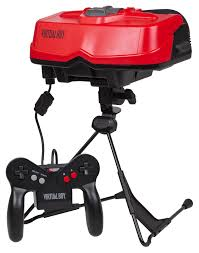
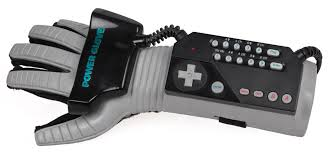

# 2.1. Genèse et Évolution de la VR

## Les prémices de la VR (Années 1956-1990)
L'histoire de la réalité virtuelle est une fascinante trajectoire d'idées visionnaires, comme par exemple avec  l’une des toutes premières machines de réalité virtuelle, le Sensorama inventé par Morton Heilig en 1956 et brevetée en 1962. Ces premières décennies ont posé les jalons conceptuels et ont vu des tentatives pionnières de donner vie à l'immersion interactive.

[le Sensorama, wikipedia](https://en.wikipedia.org/wiki/Sensorama)

L'une des figures les plus emblématiques des débuts de la VR est [Ivan Sutherland](https://fr.wikipedia.org/wiki/Ivan_Sutherland), souvent considéré comme le "père de la réalité virtuelle". Dans son article séminal de 1965, ["The Ultimate Display"](https://worrydream.com/refs/Sutherland_1965_-_The_Ultimate_Display.pdf), Sutherland décrivait sa vision d'un écran ultime capable de simuler la réalité de manière si convaincante que l'utilisateur ne pourrait plus distinguer le réel du virtuel. Cette vision a inspiré de nombreuses recherches ultérieures. Dans le prolongement de ses idées, Sutherland a créé en 1968, avec l'aide de son étudiant Bob Sproull, le premier système de casque de réalité virtuelle rudimentaire, surnommé ["The Sword of Damocles"](https://www.ulyces.co/news/le-premier-casque-de-realite-virtuelle-a-ete-invente-en-1968/). Ce dispositif, suspendu au plafond en raison de son poids, affichait des graphismes filaires 3D stéréoscopiques qui changeaient en fonction des mouvements de la tête de l'utilisateur. Bien que très limité en termes de capacités graphiques et d'interaction, il représentait une étape fondamentale dans la concrétisation du concept de VR immersive.

[The Sword of Damocles, wikipedia](https://www.researchgate.net/figure/The-Sword-of-Damocles_fig1_326444949)

 Les années 1970 et 1980 ont vu l’émergence des premières applications concrètes de la réalité virtuelle, notamment dans les domaines militaire et industriel. Les simulateurs de vol, développés par des entreprises comme Evans & Sutherland, ont intégré cockpits, commandes interactives et graphismes 3D en temps réel. Ils offraient un entraînement sécurisé et reproductible aux pilotes, tout en réduisant les coûts et les risques liés à l’utilisation d’avions réels. Il y a eu ensuite l’appropriation de la réalité virtuelle dans le secteur du jeu vidéo avec l'arrivé du [Power Gloves](https://fr.wikipedia.org/wiki/Power_Glove) et du [Virtual Boy](https://fr.wikipedia.org/wiki/Virtual_Boy)

 
 
[le virtual boy](https://fr.wikipedia.org/wiki/Virtual_Boy) et [ le power glove](https://fr.wikipedia.org/wiki/Power_Glove) wikipedia
 
 Cependant, ces tentatives ont été largement considérées comme des échecs en raison de limitations technologiques importantes : écrans de faible résolution et souvent inconfortables, suivi de mouvements rudimentaire ou inexistant, et un manque de contenu convaincant, comme pour [le Sega VR](https://fr.wikipedia.org/wiki/Sega_VR), un casque annoncé pour la console [Mega Drive](https://fr.wikipedia.org/wiki/Mega_Drive) au début des années 1990, mais qui n'a finalement jamais été commercialisé en raison de problèmes techniques et de coûts de production trop élevés. Cette période a conduit à une certaine désillusion quant au potentiel immédiat de la VR pour le marché de masse, "Le problème, c’est qu’à l’époque, cette technologie coûte cher à produire, à développer et à vendre. Le concept de réalité virtuelle est présent essentiellement dans la littérature, mais son application dans le monde réel demeure à un stade très précoce"(1).

 Ces échecs ont mis en évidence les limitations technologiques significatives de l'époque qui empêchaient la réalisation d'une expérience de réalité virtuelle véritablement immersive et abordable

## La Renaissance de la VR (Années 2000 à aujourd'hui)

Face à ces défis et aux déceptions commerciales, l'intérêt et les investissements dans la VR grand public ont considérablement diminué au début des années 2000, "En conséquence, après un pic d'intérêt et d'importants investissements, l'industrie ainsi que l'opinion publique ont commencé à se désintéresser de la réalité virtuelle, et certaines entreprises ont fait faillite"(2). Cependant, la recherche et le développement n'ont pas cessé pour autant. On a assisté à un passage progressif vers des applications plus spécifiques et professionnelles, où les avantages de la VR pouvaient justifier les coûts et les limitations technologiques de l'époque. 

Après une période relative de stagnation dans le marché grand public, la réalité virtuelle a connu une renaissance spectaculaire à partir des années 2010, propulsée par un ensemble d'avancées technologiques clés qui ont permis de surmonter bon nombre des limitations des générations précédentes :

Leur casque Oculus Rift, lancé en 2016 après une campagne Kickstarter réussie, est souvent considéré comme le catalyseur de cette renaissance de la VR grand public. Il offrait une expérience immersive de qualité à un prix relativement abordable, avec un suivi de la tête précis et un écosystème de contenu en développement.
« En 2012, Palmer Luckey lança une campagne Kickstarter pour l’Oculus Rift, un casque VR promettant des expériences de réalité virtuelle de haute qualité et abordables. […] L’acquisition d’Oculus VR par Facebook pour 2 milliards de dollars en 2014 marqua le début d’une nouvelle ère pour la VR, avec des investissements importants et un regain d’intérêt de la part du secteur technologique.»(3)

HTC Vive (en partenariat avec Valve): Lancé également en 2016, le HTC Vive se distinguait par son système de suivi spatial "Lighthouse" qui permettait un suivi des mouvements de l'utilisateur dans un espace plus large ("room-scale VR"), offrant une plus grande liberté d'interaction.Lancé en 2016 pour la console PlayStation 4 (et plus tard pour la PlayStation 5), le PSVR a rendu la VR plus accessible à un large public de joueurs déjà équipé de la console Sony.
« L’Oculus Rift, le HTC Vive et le PlayStation VR […] jouèrent également un rôle majeur dans le développement d’un écosystème croissant de contenus VR. Le développement de jeux, d’applications et d’expériences spécifiquement conçus pour la VR se développa rapidement, soutenu par des plateformes dédiées comme Oculus Home, SteamVR et le PlayStation Store. »(3)

Parallèlement à ces acteurs matériels, l'émergence de plateformes logicielles et d'écosystèmes de contenu (comme l'Oculus Store, SteamVR, PlayStation Store) a été cruciale pour fournir aux utilisateurs une variété d'expériences allant des jeux aux applications éducatives et sociales.

Écrans haute résolution et à faible latence: Le développement d'écrans OLED et LCD avec des résolutions beaucoup plus élevées (réduisant l'effet de "porte de moustiquaire") et des taux de rafraîchissement plus rapides (diminuant la latence et le motion sickness) a considérablement amélioré la fidélité visuelle et le confort de l'expérience. L'intégration d'écrans à double résolution (un pour chaque œil) a permis une véritable perception stéréoscopique en 3D.

Suivi précis et fiable (oculaire et spatial): Des systèmes de suivi sophistiqués, utilisant une combinaison de capteurs inertiels (IMU), de caméras externes (pour le suivi spatial des casques et des contrôleurs) et même de capteurs infrarouges, ont permis un suivi des mouvements de la tête et des mains beaucoup plus précis et avec une faible latence. L'introduction du suivi oculaire (eye-tracking) dans certains casques a ouvert de nouvelles possibilités pour l'interaction et le rendu fovéal (concentration de la puissance de rendu sur la zone regardée par l'utilisateur).

Puissance de calcul abordable: Les progrès rapides dans les processeurs graphiques (GPU) et les unités centrales de traitement (CPU), combinés à une baisse des coûts de production, ont rendu possible le rendu en temps réel de graphismes 3D complexes nécessaires à des expériences VR immersives sur des plateformes plus accessibles.

Connectivité et standardisation : L'amélioration de la connectivité sans fil (Wi-Fi rapide, Bluetooth) et l'émergence de certaines normes ont facilité l'utilisation des casques VR et la communication avec les ordinateurs ou les consoles.

"Malgré ses nombreuses applications, la VR présente également des limites. En effet, la technologie est encore relativement coûteuse et nécessite l’utilisation de casques de réalité virtuelle, ce qui peut être inconfortable pour certains utilisateurs. De plus, la VR peut entraîner des nausées et des maux de tête chez certains utilisateurs sensibles. Enfin, la réalité virtuelle est souvent critiquée pour son manque de contenu de qualité et pour son impact sur la société, notamment en termes de l’isolement social qu’elle peut entraîner. Le film “Ready Player One”, qui simule un univers dystopique, ou la série “Black Mirror” ont contribué à augmenter la méfiance envers le développement de cette nouvelle technologie."(1)

-------------------------------------------------------------------------------------------------------------------------------

1. [Clément Gillet - L’histoire de la réalité virtuelle (2022)](https://virtual-mag.com/encyclopedie/histoire-vr/?utm_source=chatgpt.com) 

2. [Analysis of Human Factor Issues Affecting Virtual Reality Flight Training Effectiveness (2023)](https://www.researchgate.net/publication/370095391_Analysis_of_Human_Factor_Issues_Affecting_Virtual_Reality_Flight_Training_Effectiveness)

3. [The Modern History of Virtual Reality](https://virtualrealities.co.za/the-modern-history-of-virtual-reality/?utm_source=chatgpt.com)

4. 