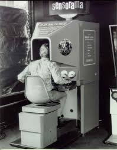

# 2.1. Genèse et Évolution de la VR

## Les Précurseurs et les Visions Initiales  (Années 1956-1990)
L'histoire de la réalité virtuelle est une fascinante trajectoire d'idées visionnaires, comme par exemple avec  l’une des toutes premières machines de réalité virtuelle, le Sensorama inventé par Morton Heilig en 1962. Ces premières décennies ont posé les jalons conceptuels et ont vu des tentatives pionnières de donner vie à l'immersion interactive.

 [le Sensorama](https://en.wikipedia.org/wiki/Sensorama)

L'une des figures les plus emblématiques des débuts de la VR est [Ivan Sutherland](https://fr.wikipedia.org/wiki/Ivan_Sutherland), souvent considéré comme le "père de la réalité virtuelle". Dans son article séminal de 1965, ["The Ultimate Display"](https://worrydream.com/refs/Sutherland_1965_-_The_Ultimate_Display.pdf), Sutherland décrivait sa vision d'un écran ultime capable de simuler la réalité de manière si convaincante que l'utilisateur ne pourrait plus distinguer le réel du virtuel. Cette vision a inspiré de nombreuses recherches ultérieures. Dans le prolongement de ses idées, Sutherland a créé en 1968, avec l'aide de son étudiant Bob Sproull, le premier système de casque de réalité virtuelle rudimentaire, surnommé ["The Sword of Damocles"](https://www.ulyces.co/news/le-premier-casque-de-realite-virtuelle-a-ete-invente-en-1968/). Ce dispositif, suspendu au plafond en raison de son poids, affichait des graphismes filaires 3D stéréoscopiques qui changeaient en fonction des mouvements de la tête de l'utilisateur. Bien que très limité en termes de capacités graphiques et d'interaction, il représentait une étape fondamentale dans la concrétisation du concept de VR immersive.

## Les Périodes de "Hype" et les Désillusions (Années 1990-2010)

## La Renaissance de la VR (Années 2010 à aujourd'hui)