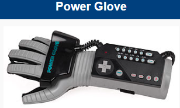
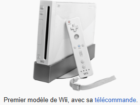
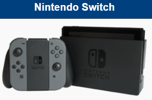

# 1.2 Support technologiques antérieurs à la VR: Les précurseurs des interactions gestuelles

Avant que la réalité virtuelle ne popularise les casques immersifs et les systèmes de suivi de mouvements sophistiqués, plusieurs plateformes et périphériques ont exploré différentes manières de traduire les gestes humains en actions numériques. Ces tentatives, bien que souvent limitées par la technologie de l'époque, ont joué un rôle crucial dans la familiarisation du public avec l'idée d'une interaction plus directe et physique avec les environnements numériques, et ont posé les bases pour les avancées que nous observons aujourd'hui en VR. Bodkhe (2024) présente une revue des interactions gestuelles numériques avant l'arrivée de la VR (*[1](https://sdlccorp.com/post/how-motion-controls-have-evolved-in-console-gaming/)*)

**[Le Power Glove](https://electronics.howstuffworks.com/nintendo-power-glove.htm)** , sorti par Nintendo pour sa console NES en 1989, est un exemple précoce et ambitieux de tentative de capture des mouvements de la main pour l'interaction dans les jeux vidéo. Le Power Glove utilisait une combinaison de capteurs : des potentiomètres pour mesurer la flexion des doigts, et un émetteur ultrasonique sur le dos de la main qui, combiné à des récepteurs sur une barre de capteurs, tentait de déterminer la position et l'orientation de la main dans l'espace. Les joueurs pouvaient ainsi, théoriquement, contrôler des actions à l'écran en bougeant leurs mains et leurs doigts. 

Malgré ses limitations techniques, Bodkhe le souligne _"le gant avait du mal à être précis, et seule une poignée de jeux étaient compatibles avec lui"_ (*1*). Le Power Glove a semé les graines de l'idée d'une interaction plus directe et gestuelle dans les environnements numériques, influençant les réflexions futures sur les interfaces homme-machine. _"Il a montré que même à l’époque, les développeurs de jeux expérimentaient de nouvelles façons d’engager physiquement les utilisateurs, même si le résultat n’était pas encore affiné"_. (*1*)

 Power glove, Wikipédia 

**[Wii](https://www.nintendo.com/fr-fr/Wii/Wii-94559.html?srsltid=AfmBOoojl8VbI0NYJLr1CUQ9KnhxV2TxCLV9bAOezmeZwP2--uSeTKLo) & Wiimote** (2006): La Nintendo Wii a marqué un tournant dans l'histoire du jeu vidéo en popularisant les interactions basées sur les mouvements comme le souligne Bodkhe _"Nintendo a puisé dans l’essence de ce qui rend les jeux amusants en interaction physique et ils l’ont exécuté d’une manière à la fois naturelle et précise"_ Sa télécommande, la Wiimote, équipée d'accéléromètres et de capteurs infrarouges, permettait aux joueurs de contrôler les jeux en mimant des actions réelles. Des jeux comme _**[Wii Sports (Nintendo Wii, 2006)](https://fr.wikipedia.org/wiki/Wii_Sports)**_ utilisaient la télécommande Wii Remote, avec ses capteurs de mouvements, permettant des simulations gestuelles pour des sports comme le tennis (imiter un swing de raquette), le bowling (mimer un lancer de boule) ou le golf (simuler un swing de club). Bien que simplifiées, ces interactions offraient une forme d'engagement physique et une immersion nouvelle pour un large public.

 Wii, Wikipédia

**[Kinect (Xbox 360)](https://fr.wikipedia.org/wiki/Kinect)** : Bien que principalement axé sur le divertissement et le fitness, Kinect a démontré la faisabilité de la capture de mouvements corporels complexes et a ouvert des perspectives pour des interactions plus naturelles dans divers domaines grâce a la caméra 3D innovante qu'il propose. Nandini Bodkhe d'écrit la Kinect comme _"il pouvait détecter la profondeur et le mouvement, permettant une expérience sans les mains"_ (*1*) et avec un potentiel pour les nouveau jeux vidéo comme _**[Kinect Sport](https://fr.wikipedia.org/wiki/Kinect_Sports)**_. Kinect Sport est sorti en novembre 2010 lors du lancement du périphérique Kinect avec lequel il est compatible.
Le jeu est semblable à Wii Sports et Sports Champions. Il propose de prendre part à plusieurs activités sportives, notamment du beach-volley, du football, du ping-pong, de la boxe, du bowling et de l'athlétisme.

Cependant, des limitations en termes de précision et de latence ont parfois entravé une expérience utilisateur optimale pour des interactions très fines. Bodkhe le cite _" Au fil du temps, les jeux captivants et les questions pratiques ont conduit à son déclin. Microsoft a finalement abandonné le Kinect en 2017, mais ses innovations telles que la commande vocale et la reconnaissance gestuelle ont vécu dans d’autres technologies"_

Kinect, Wikipédia

**[Nintendo Switch](https://fr.wikipedia.org/wiki/Nintendo_Switch) & [Joy-Cons](https://fr.wikipedia.org/wiki/Joy-Con)** (2017): La polyvalence des contrôleurs modulaires (2017). La Nintendo Switch a introduit les manettes Joy-Cons, qui intègrent des gyroscopes et des accéléromètres sophistiqués. Ces capteurs permettent une variété d'interactions gestuelles, allant de la visée intuitive en inclinant la manette dans des jeux de tir, aux mouvements de bras et de poignets détectés dans des titres comme ARMS ou les mini-jeux de 1-2-Switch. La modularité des Joy-Cons a également permis des expériences uniques exploitant la détection de mouvements individuels pour chaque main, préfigurant certaines des interactions que l'on retrouve aujourd'hui avec les contrôleurs VR. _"Cette évolution reflète la façon dont une société de développement de consoles peut mélanger les vieilles idées avec la technologie moderne pour créer quelque chose de nouveau et passionnant"_ (*2*)

Switch, Wikipédia

Ces dispositifs précurseurs ainsi que les sociétés de développement de jeux vidéos ont joués un rôle déterminant dans l’évolution des interactions gestuelles numériques, bien avant l’émergence de la réalité virtuelle immersive. Chacun a contribué à repousser les frontières de l’interaction homme-machine. Ces technologies ont non seulement permis de familiariser les utilisateurs avec des interfaces plus naturelles et physiques, mais ont également inspiré les avancées technologiques et conceptuelles indispensables au développement des systèmes VR actuels. Elles constituent ainsi les fondations sur lesquelles s’appuie la réalité virtuelle pour offrir des expériences immersives de plus en plus riches, précises et intuitives.

-------------------------------------------------------------------------------------------------------------------------------

1. [Nandini Bodkhe - How Motion Controls Have Evolved in Console Gaming,  2024](https://sdlccorp.com/post/how-motion-controls-have-evolved-in-console-gaming/)
